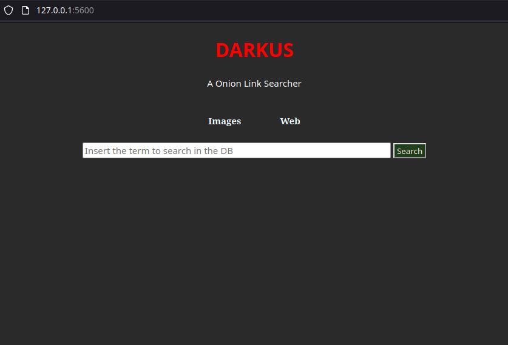

<p align = "center">

</p>

<p align = "center">


</p>

***Darkus is a Onion websites searcher it uses deep/dark web searcher engines to search a specific word and give you back the link results.***

## DISCLAIMER

***This tool is intented only for research and educational purposes only. I do not assume any liability for any bad/illegal usage of this tool.***


## Screenshot:


## Local Database:



## Installation:
```bash
git clone https://github.com/Lucksi/Darkus
cd Darkus
sudo apt-get update
sudo chmod +x Installer.sh
sudo bash Installer.sh
```

## Installation (Venv):
**if you encounter some errors in the python libraries installation use this method:**
```bash
git clone https://github.com/Lucksi/Darkus
sudo apt-get update
cd Darkus
python3 -m venv .lib_venv
sudo chmod +x Installer.sh
sudo bash Installer.sh
source .lib_venv/bin/activate
pip3 install -r requirements.txt
```

## Execution:
```bash
cd Darkus
sudo python3 Main.py (Database on)
python3 Main.py (Database off)
```
## Execution (Venv)
```bash
cd Darkus
source .lib_venv/bin/activate
python3 Main.py
```

## Current Search Engines:

| Name | Link |
| ------------- | ------------- |
| `Ahmia(Clear Web site)`  | https://ahmia.fi |
| `Ahmia(Onion Site)`  | http://juhanurmihxlp77nkq76byazcldy2hlmovfu2epvl5ankdibsot4csyd.onion |
| `Torch(Onion Site)`  | http://torchdeedp3i2jigzjdmfpn5ttjhthh5wbmda2rr3jvqjg5p77c54dqd.onion  | 
| `notevil(Onion Site)`  | http://notevilmtxf25uw7tskqxj6njlpebyrmlrerfv5hc4tuq7c7hilbyiqd.onion  |

## Current command list:

| Option name | Result |
| ------------- | ------------- |
| `Help`  | Print Command Options |
| `DB-A`  | Activate Local Database |
| `DB-D`  | Deactivate Local Database |
| `DB-S`  | Local Database Status  |
 `--Check`  | Check if the given url is included on Ahmia Blacklist  | 
| `Darkus-Exit`  | Exit from the programm  | 


## Requirements:
    [+]Python3
    [+]Tor
    [+]Php
    [+]Internet Connection

## STARGAZERS OVER TIME 


[](https://starchart.cc/Lucksi/Darkus)

<br>


## <p align= center>MADE WITH :heart: BY LUCKSI IN :it:</p>

## <p align = center>  ORIGINAL CREATOR: <a href = "https://github.com/Lucksi">LUCA GAROFALO (Lucksi)</a></p>


## <p align = center>LICENSE: GPL-3.0 License <br>COPYRIGHT: (C) 2023-2024 Lucksi 
